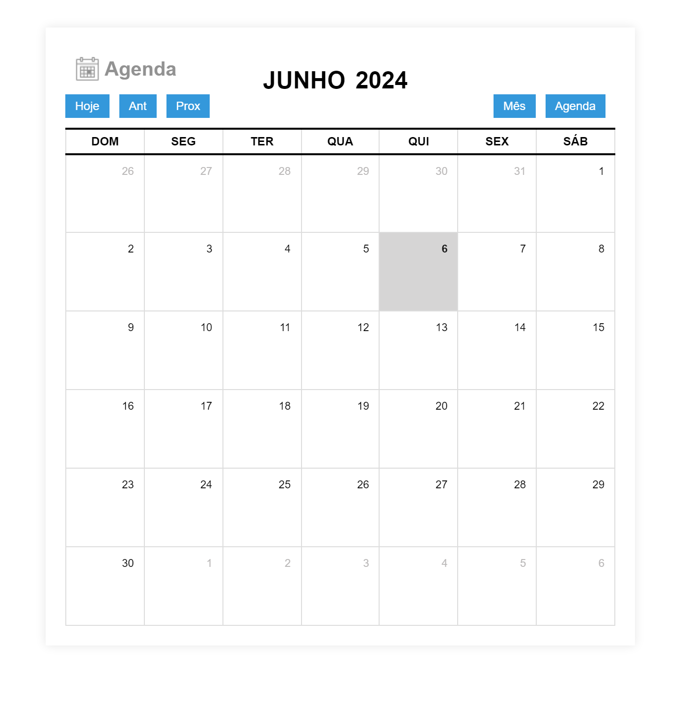

# Calendário 

## Índice
1. [Visão Geral](#visão-geral)
2. [Funcionalidades](#funcionalidades)
3. [Estrutura do Projeto](#estrutura-do-projeto)
4. [Tecnologias Utilizadas](#tecnologias-utilizadas)
5. [Como Usar](##comousar)
6. [Autor](#autor)

## Visão Geral
Este é um projeto de calendário que permite visualizar, adicionar, editar e excluir eventos. Ele exibe os dias do mês atual em uma tabela, com a capacidade de navegar para meses anteriores, próximos e retornar ao mês atual. Também é possível visualizar todas as tarefas agendadas em um modal de agenda.

## Funcionalidades
-**Visualização de Calendário:** O calendário exibe os dias do mês atual em uma tabela, destacando o dia atual.

-**Navegação de Calendário:** Os botões "Ant", "Prox" e "Hoje" permitem navegar para o mês anterior, mês seguinte ou retornar ao mês atual, respectivamente.

-**Adição de Eventos:** Você pode adicionar novos eventos clicando em um dia específico do calendário, o que abrirá um modal para inserir os detalhes do evento.

-**Edição de Eventos:** Os eventos existentes podem ser editados clicando sobre eles no calendário, o que abrirá um modal de edição com os detalhes do evento.

-**Exclusão de Eventos:** Os eventos podem ser excluídos clicando no botão "Apagar Tarefa" no modal de edição do evento.

-**Visualização de Todas as Tarefas:** O botão "Agenda" permite visualizar todas as tarefas agendadas em um modal.

## Estrutura do Projeto
Esse site foi cuidadosamente projetado e organizado para proporcionar uma experiência intuitiva ao usuário. A estrutura inclui:

- `index.html`:  O arquivo HTML principal que define a estrutura da página.
- `style.css`: O arquivo CSS que contém os estilos principais da página.
- `script.js`: O arquivo JavaScript responsável pela funcionalidade interativa da página.
- `readme.md`: O arquivo Markdown que fornece informações sobre o projeto.
-`icon-agenda.png`: Uma imagem representando o ícone da agenda.

## Tecnologias Utilizadas
- **HTML5**: Estrutura do site.
- **CSS3**: Estilos e layout do site.
- **JavaScript**: Funcionalidades interativas.

## Como Usar
1-Abra o arquivo index.html em seu navegador da web.

2-Navegue pelo calendário usando os botões de navegação ou clicando diretamente em um dia para adicionar um novo evento.

3-Para editar um evento existente, clique sobre ele no calendário para abrir o modal de edição.

4-Para excluir um evento, abra o modal de edição do evento e clique no botão "Apagar Tarefa".

5-Para visualizar todas as tarefas agendadas, clique no botão "Agenda".

6-Você pode adicionar novas cores de eventos editando o arquivo style.css e adicionando novas classes de cores.

## Autor
Desenvolvido por Nayara Karine.
---

